<!---
  GitHub profile README for kmr-rohit.
  Source of truth: kmr-rohit/portfolio → github-profile/
  Regenerate SVGs with `npm run github-profile`, then copy README.md + assets/
  into the special repo kmr-rohit/kmr-rohit (see HOW_TO_PUBLISH.md).
--->

<div align="center">



[](https://kmrrohit.space)

[](https://kmrrohit.space)
[](https://github.com/kmr-rohit)
[](https://www.linkedin.com/in/rr7433446/)
[](https://github.com/kubeflow/docs-agent)
[](https://kmrrohit.space)

</div>



I build AI systems that have to survive production — tool-calling loops, multi-index retrieval, and the eval harness that tells you whether a prompt change helped. By day I ship agentic workflows inside Oracle Fusion SCM. Outside that I expand [`kubeflow/docs-agent`](https://github.com/kubeflow/docs-agent) through Google Summer of Code 2026 and write about inference, agents, and RAG.

**Now.** GSoC contributor on Kubeflow (org member as of Aug 2026). Looking for senior AI engineering work on agent platforms, inference/serving, or retrieval — the layer where the naive approach stops working.

<p align="center">
  <a href="https://kmrrohit.space">site</a> ·
  <a href="https://kmrrohit.space/writing">writing</a> ·
  <a href="https://kmrrohit.space/opensource">open source</a> ·
  <a href="https://kmrrohit.space/rohit-kumar-resume-ai.pdf">résumé · AI</a> ·
  <a href="mailto:rr7433446@gmail.com">email</a>
</p>

---

## `/now`



| | | |
| --- | --- | --- |
| **[Kubeflow Docs Agent](https://github.com/kubeflow/docs-agent)** | GSoC 2026 · agentic RAG + MCP over docs, issues, code, manifests. Helm edge, Terraform, OKE CI/CD. | [PRs](https://github.com/kubeflow/docs-agent/pulls?q=is%3Apr+author%3Akmr-rohit) · [write-up](https://kmrrohit.space/writing/agentic-rag-for-kubeflow) |
| **[Fusion SCM](https://kmrrohit.space)** | Oracle — catalog, order, planner agents. Part matching +~30%. Order agent 10k+ lines/run. Kafka alert microservice. | [profile](https://kmrrohit.space/profile) |
| **[MacBatch](https://github.com/kmr-rohit/macbatch)** | Batch inference on idle Apple Silicon. Lease scheduler + worker CLI. 252k embeds/hour on one MBA. | [product](https://macbatch.vercel.app/) · [docs](https://kmr-rohit.github.io/macbatch/) |
| **[CrackRound](https://kmrrohit.space/projects)** | Agentic mock interviews: 1.5s voice loop, live code judge, $2/session ceiling. | [projects](https://kmrrohit.space/projects) |

---

## `git log --author=kmr-rohit`



| when | what | |
| --- | --- | --- |
| Aug 2026 | Added as **Kubeflow org member** | [internal-acls#953](https://github.com/kubeflow/internal-acls/pull/953) |
| Aug 2026 | CI: `GITHUB_TOKEN` for GHCR, optional pull secrets | [docs-agent#232](https://github.com/kubeflow/docs-agent/pull/232) |
| Aug 2026 | Anonymous session-JWT auth for the public chatbot | [docs-agent#219](https://github.com/kubeflow/docs-agent/pull/219) |
| Aug 2026 | Istio edge → Helm `gateway-guardrails` (rate limits, CORS) | [docs-agent#218](https://github.com/kubeflow/docs-agent/pull/218) |
| Jun 2026 | 3-tool MCP, TEI embeddings, issues/code pipelines, OKE CI/CD · +5.4k | [docs-agent#210](https://github.com/kubeflow/docs-agent/pull/210) |
| Mar 2026 | Terraform modules: OKE cluster + full Kubeflow platform on OCI | [deploy-kubeflow#5](https://github.com/jaiakash/deploy-kubeflow/pull/5) |

I host the [Kubeflow Docs Agent community call](https://kmrrohit.space/opensource) every other Saturday (11:00 PM IST / 17:30 UTC). Spoke at **Kubeflow Community Showcase 2026**; was at **KubeCon + CloudNativeCon India 2026** (Mumbai).

---

## `cat ~/writing`



- [Teaching a docs agent to read the repo](https://kmrrohit.space/writing/agentic-rag-for-kubeflow) — why docs-only RAG fails on infrastructure questions
- [SGLang, or a runtime that remembers](https://kmrrohit.space/writing/sglang-architecture) — radix KV cache, speculative scheduling
- [Context engineering, after the window stopped being the problem](https://kmrrohit.space/writing/context-engineering-for-agents)
- [vLLM from the inside](https://kmrrohit.space/writing/vllm-architecture) — scheduler, block pool, the host-side tax V1 killed
- [The harness is the product](https://kmrrohit.space/writing/the-agentic-harness) — the loop around the model is what is actually yours
- [The two clocks](https://kmrrohit.space/writing/the-two-clocks) — prefill vs decode, and why serving is hard

---

## `/proc/stats`



<div align="center">
  
</div>

<div align="center">
  
</div>

<!--- Uncomment after copying snake.yml into kmr-rohit/kmr-rohit and running the workflow once
<div align="center">
  <picture>
    <source media="(prefers-color-scheme: dark)" srcset="https://raw.githubusercontent.com/kmr-rohit/kmr-rohit/output/github-contribution-grid-snake-dark.svg" />
    <source media="(prefers-color-scheme: light)" srcset="https://raw.githubusercontent.com/kmr-rohit/kmr-rohit/output/github-contribution-grid-snake.svg" />
    
  </picture>
</div>
--->

<p align="center">
  
</p>

**Agents & serving** — LangGraph, MCP, Agentic RAG, vLLM, SGLang, KServe, TEI, Milvus  
**Platform** — Kubernetes, Kubeflow Pipelines, Istio, Helm, Terraform, OCI/OKE, Kafka, Prometheus

---

<div align="center">

```
kmr-rohit@oracle ~ $ echo "hi"
hi. I read issues, code, and manifests — not just the docs.

        .--.
       |o_o |     github.com/kmr-rohit
       |:_/ |     kmrrohit.space
      //   \ \
     (|     | )
    /'\_   _/`\
    \___)=(___/
```

[site](https://kmrrohit.space) · [writing](https://kmrrohit.space/writing) · [email](mailto:rr7433446@gmail.com) · [linkedin](https://www.linkedin.com/in/rr7433446/)

</div>
